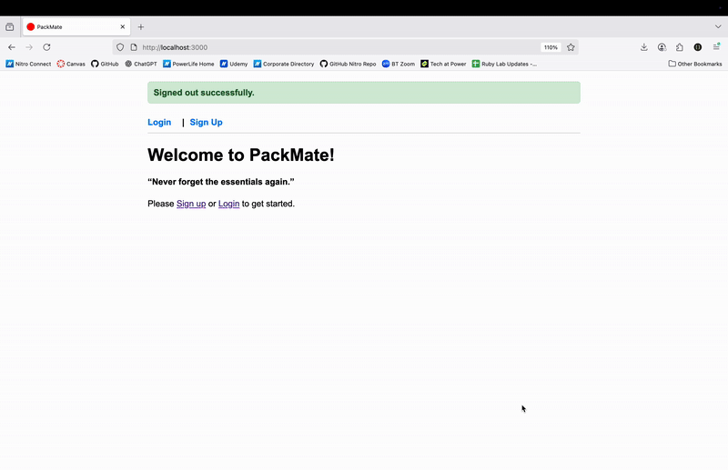
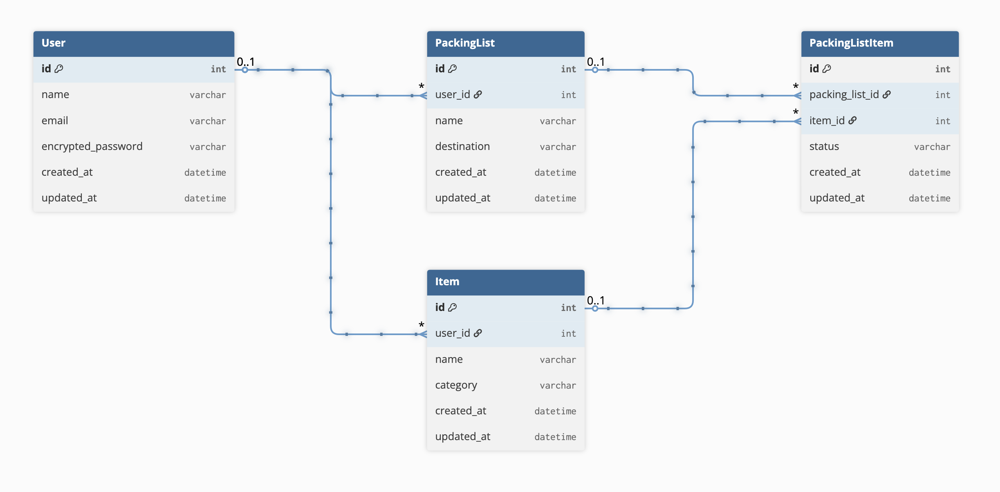

# Pack-Mate

A full-stack Rails application for creating and managing packing lists. Users can create multiple packing lists, add items, check them off when packed and delete the list once the trip is complete. Built with Rails 8 and Devise authentication.

## Getting Started

### Prerequisites

- Ruby (version 3.3.5 or higher)
- Rails 8.0.2.1
- SQLite3
- Git

### Set Up & Installation

1. Clone the repository

```ruby
git clone git@github.com:kenjelly22/pack-mate.git
cd pack-mate
```

2. Install dependencies

```ruby
bundle install
```

3. Set up the database and seed file

```ruby
bin/rails db:migrate
bin/rails db:seed
```

4. Run the server

```ruby
bin/rails server
```

5. Open in browser

Visit: http://localhost:3000

## How to Use

1. Navigate to http://localhost:3000
2. Sign up for a new account or login
3. Create your first packing list
4. Add items to your packing list
5. Check off items once they are packed
6. Delete packing list once trip is complete

## Tech Stack

- Backend: Ruby on Rails 8.0.2.1
- Database: SQLite3
- Authentication: Devise
- Testing: RSpec with FactoryBot, Faker and shoulda-matchers
- Styling: Custom CSS
- Code Quality: Nitro RuboCop compliant

## Testing

1. Run RSpec to run the test suite.

```ruby
bundle exec rspec
```

## Demo



## ERD Diagram


